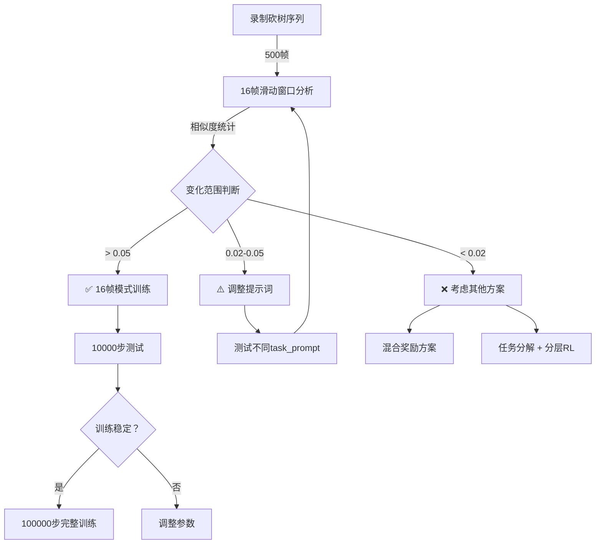

# ✅ MineCLIP 16帧视频模式 - 已完成实施

> **完成时间**: 2025-10-21  
> **目标**: 建立通用MineCLIP奖励框架，实现任意技能自主学习  
> **状态**: 代码改造完成，待验证效果 ⏳

---

## 🎉 **已完成的工作**

### **1. 核心代码改造** ✅

| 文件 | 改动 | 说明 |
|------|------|------|
| `src/utils/mineclip_reward.py` | 新增16帧视频支持 | 帧缓冲、视频编码、官方MineCLIP流程 |
| `src/training/train_get_wood.py` | 新增视频模式参数 | `--use-video-mode`, `--num-frames`, `--compute-frequency` |
| `scripts/train_get_wood.sh` | （待更新） | 需添加视频模式参数支持 |

**核心特性**:
- ✅ 16帧滚动窗口（`deque`）
- ✅ 稀疏计算（每N步计算一次MineCLIP）
- ✅ MineCraft官方归一化参数
- ✅ 完整的`encode_video`流程
- ✅ 动态任务描述（视频模式用动作描述）

### **2. 验证工具** ✅

| 工具 | 功能 | 用途 |
|------|------|------|
| `record_chopping_sequence.py` | 录制砍树过程 | 获取真实的16帧连续序列 |
| `verify_mineclip_16frames.py` | 分析16帧视频效果 | 计算相似度、统计分析、可视化 |
| `quick_verify.sh` | 一键验证脚本 | 3种验证模式，交互式选择 |

### **3. 文档** ✅

- `MINECLIP_16FRAMES_GUIDE.md` - 完整使用指南
- `UNIVERSAL_MINECLIP_STRATEGY.md` - 通用框架战略
- `IMPLEMENTATION_PLAN.md` - 实施计划（3阶段）

---

## 🚀 **立即开始验证**

你现在可以**录制砍树过程**来验证16帧MineCLIP效果！

### **最简单的方式 - 使用快捷脚本**

```bash
# 1. 激活环境
conda activate minedojo-x86

# 2. 运行快捷脚本
./quick_verify.sh

# 3. 选择模式2（录制新的砍树序列）
```

### **手动方式**

```bash
# 步骤1: 录制砍树过程
python record_chopping_sequence.py \
    --output-dir logs/my_chopping \
    --max-frames 500

# 步骤2: 验证效果
python verify_mineclip_16frames.py \
    --sequence-dir logs/my_chopping \
    --task-prompt "chopping a tree with hand"

# 步骤3: 查看结果
cat logs/my_chopping/similarity_results.txt
open logs/my_chopping/similarity_analysis.png
```

---

## 📊 **预期结果解读**

验证脚本会输出：

```
📊 相似度统计:
  最小值: 0.xxxx
  最大值: 0.xxxx
  变化范围: 0.xxxx  ← 🔑 关键指标

🎯 评估结论:
  [自动判断]
```

**判断标准**:

| 变化范围 | 评估 | 建议 |
|---------|------|------|
| > 0.05 | ✅ 优秀 | 立即使用16帧模式训练 |
| 0.02-0.05 | ⚠️  可用 | 尝试调整提示词 |
| < 0.02 | ❌ 效果差 | 考虑混合奖励或任务分解 |

---

## 🎯 **核心思想**

### **为什么需要16帧视频模式？**

```
单帧MineCLIP:
  输入: 一张图 → "看到一棵树"
  区分度: 0.007 ❌
  问题: 无法理解"动作"

16帧MineCLIP:
  输入: 16帧视频 → "正在砍树"
  区分度: ??? ⏳ 待验证
  优势: 理解动作和过程
```

### **官方MineCLIP的设计**

MineCLIP训练在280万YouTube Minecraft视频上：
1. 输入：16帧连续序列 `[1, 16, 3, H, W]`
2. 处理：`forward_image_features()` (每帧) + `forward_video_features()` (时序聚合)
3. 输出：理解"动作"的视频特征

**我们之前的单帧模式跳过了第2步，所以效果差！**

---

## 📝 **关键参数说明**

### **训练参数**

```bash
# 启用16帧视频模式（默认）
--use-video-mode

# 禁用（回退到单帧模式）
--no-video-mode

# 视频帧数（默认16，官方标准）
--num-frames 16

# 计算频率（每N步计算一次MineCLIP）
--compute-frequency 4
# - 值越小，奖励越频繁，但开销越大
# - 推荐：2-8之间
# - 默认4：平衡效果和性能
```

### **任务描述**

```python
# 视频模式：使用动作描述
task_prompt = "chopping a tree with hand"  ✅
task_prompt = "punching a tree trunk"      ✅
task_prompt = "mining wood with hand"      ✅

# 单帧模式：使用视觉描述
task_prompt = "tree"                       ✅
task_prompt = "oak tree in minecraft"      ✅

# 避免过于复杂的描述
task_prompt = "a player is using their hand to chop down..."  ❌
```

---

## 🔄 **完整工作流程**



---

## 🎬 **下一步行动**

### **立即行动（你提到的）**

> "我可以录制一个我来砍树的整个过程，保存这些帧画面进行验证"

**完美！** 这是最好的验证方式。

**操作步骤**:

1. **录制** (15分钟):
   ```bash
   python record_chopping_sequence.py --output-dir logs/my_chopping --max-frames 500
   ```
   - 游戏启动后手动控制角色
   - 寻找树 → 靠近 → 砍树 → 收集木头
   - 按Ctrl+C停止

2. **验证** (5分钟):
   ```bash
   python verify_mineclip_16frames.py --sequence-dir logs/my_chopping
   ```

3. **决策** (根据结果):
   - 如果变化范围 > 0.05 → 立即开始16帧模式训练 ✅
   - 如果变化范围 < 0.05 → 讨论下一步方案 ⚠️

---

## 📖 **相关文档**

| 文档 | 内容 |
|------|------|
| `MINECLIP_16FRAMES_GUIDE.md` | 完整使用指南 |
| `UNIVERSAL_MINECLIP_STRATEGY.md` | 通用框架战略 |
| `IMPLEMENTATION_PLAN.md` | 3阶段实施计划 |

---

## ⚡ **快速命令参考**

```bash
# 录制砍树序列
python record_chopping_sequence.py --output-dir logs/my_chopping

# 验证16帧效果
python verify_mineclip_16frames.py --sequence-dir logs/my_chopping

# 快捷脚本（交互式）
./quick_verify.sh

# 训练测试（10000步）
./scripts/train_get_wood.sh test \
    --timesteps 10000 \
    --use-mineclip \
    --use-video-mode \
    --num-frames 16 \
    --compute-frequency 4

# TensorBoard可视化
tensorboard --logdir logs/tensorboard
```

---

## 🎯 **核心目标回顾**

> "我的远期目标是能够自发训练任何技能，所以不可能手动对所有的技能进行密集奖励设计，所以才引入mineclip做奖励辅助设计"

**完全理解！** 这就是为什么我们要：

1. ✅ **正确实现MineCLIP** - 16帧视频模式，符合官方设计
2. ⏳ **验证效果** - 录制砍树序列，测试区分度
3. 📋 **建立通用框架** - 任何任务只需改变文本描述

**如果16帧MineCLIP效果好，你的框架就是**:

```python
# 通用训练函数
def train_any_skill(task_id, task_prompt):
    env = minedojo.make(task_id)
    env = MineCLIPRewardWrapper(
        env,
        task_prompt=task_prompt,  # 唯一需要改的！
        use_video_mode=True,
        num_frames=16
    )
    model.learn(...)

# 训练任何技能
train_any_skill("harvest_1_log", "chopping a tree")
train_any_skill("hunt_1_cow", "killing a cow")
train_any_skill("mine_1_iron_ore", "mining iron ore")
```

**无需手动设计奖励！** 🎉

---

## ✅ **准备好了吗？**

所有代码已完成，工具已就绪！

**开始录制砍树序列吧！** 🎬

```bash
conda activate minedojo-x86
./quick_verify.sh
# 选择 2) 录制新的砍树序列
```

录制完成后，我们一起分析结果，决定下一步！🚀

